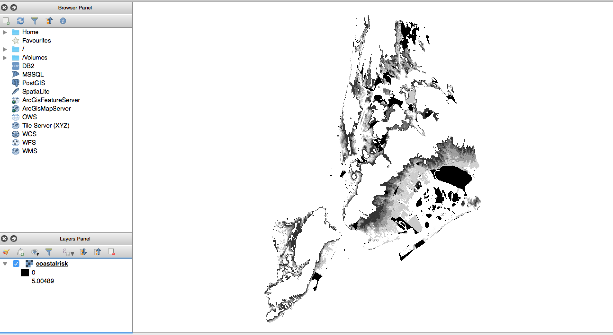
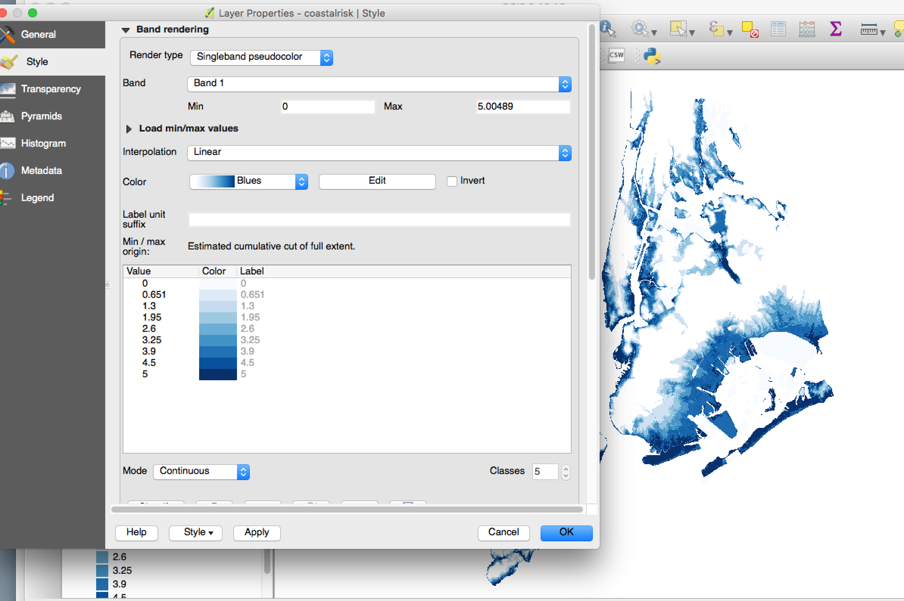
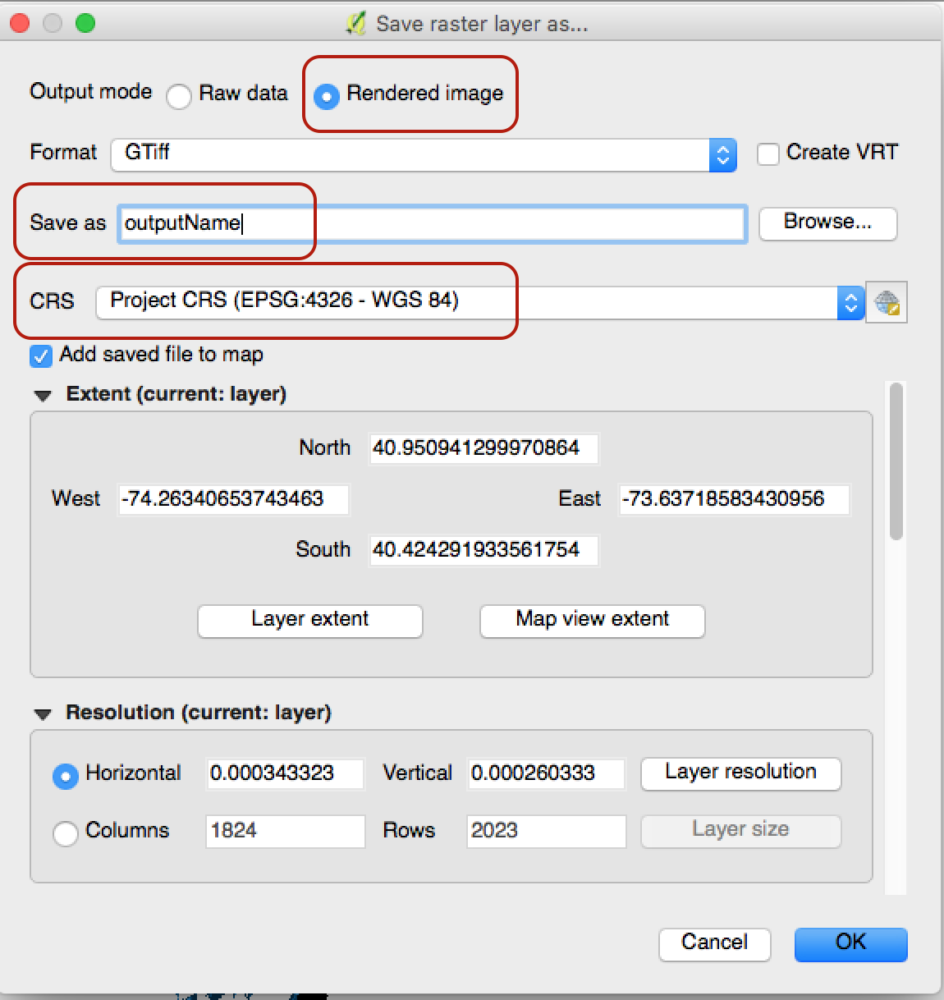
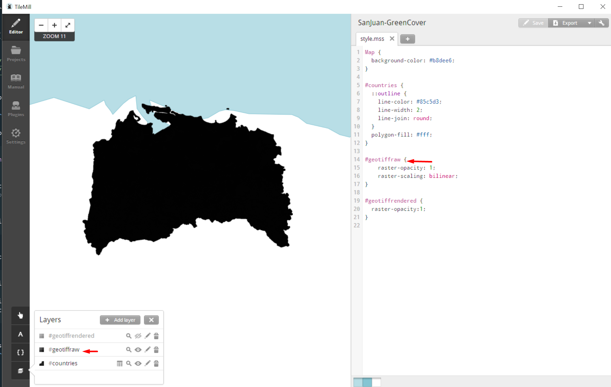
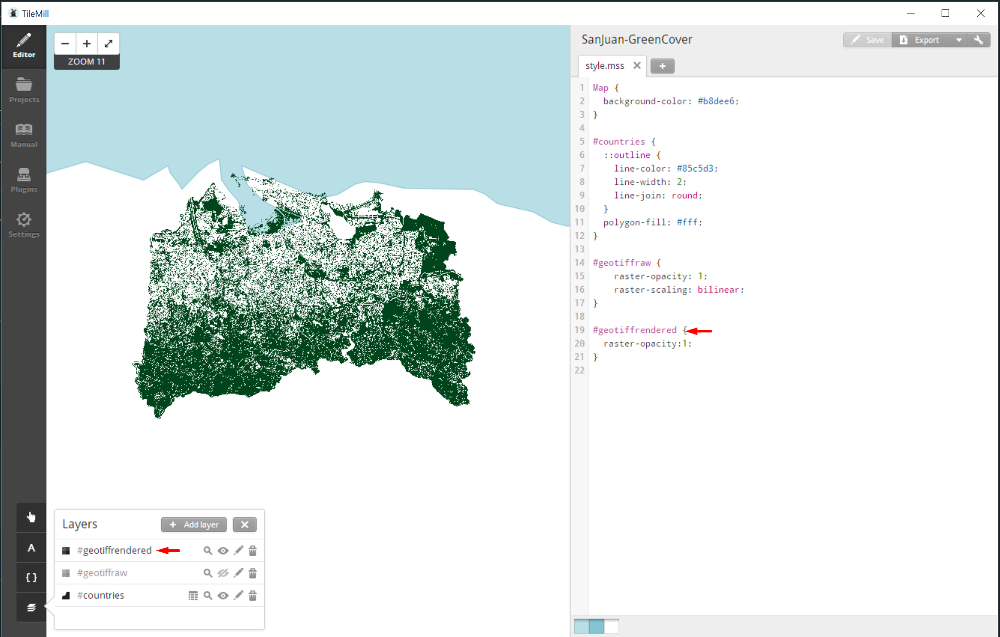

# Creating Raster MBTiles from GeoTiff

There are a few options for creating Raster MBTiles which include [TileMill](https://tilemill-project.github.io/tilemill/), [Gdal2Mbtiles](https://github.com/ecometrica/gdal2mbtiles), and [Mapbox Studio Classic](https://github.com/mapbox/mapbox-studio-classic). That said, we have been most successful by prepping the images first in [QGIS](https://www.qgis.org/en/site/) and then using [gdal translate](http://www.gdal.org/) to create the tiles.

If the raster image file is small enough, it may be possible to upload it directly to mapbox studio without first creating a '.mbtile' file, however the [allowable size](https://www.mapbox.com/help/uploads/) is quite small and you have a more limited ability to style the map. 

## Primary Method: QGIS Image Preperation + GDAL Translate

### 1. Setting up Python Environment
First, prior to using GDAL, it may be necessary to create a python2.7 environment. You can read about setting up environments [here](https://conda.io/docs/user-guide/getting-started.html#managing-environments). This will take a few minutes as it may need to install necessary packages.
```sh
conda create -n python2 python=2.7 anaconda
```
You can activate the environment you just created by running:
```sh
source activate python2
```
Whenever you need to leave this environment, you can simply run `source deactivate`.

Install [gdal](http://www.gdal.org/). 

```sh
conda install gdal
```
GDAL (Geospatial Data Abstraction Library) is an open source tool which is incredibly helpful for spatial data transformations.

### 2. Image Preparation Stage: 

Before preforming the translation into MBTiles it is often helpful to first prepare the image in some GIS software (we used [QGIS](https://www.qgis.org/en/site/)). Without this, we ran into some problems where gdal_translate oversimplified the gradient in the original image and did not account for 'no value' regions. 

In our case, we used QGIS to do the following: 

#### Add color

To do this, start by dragging a raster file (generally either '.adf' or '.tif' file) into QGIS Layers Panel. This should present an image of your map. 


From here, we can alter the image properties by right clicking on the layer name and going to 'properties'. Often, the `Render Type` is set to 'Singleband Gray', but we can add color by changing that to 'Singleband pseudocolor' and select a `Color` that fits the map (QGIS comes with some great default color gradient options). This also often takes care of inverted color scales (where darker regions are actually lower values) - if this is not the case, you can 'invert' using the checkbox to the right of the color selection.



#### Change/Ensure Projection and Save as Rendered Image (GTiff)

At this point, we can save our changes using the `Save as` option. 

Here, it is important to make sure to **select 'Rendered Image' and the correct projection** for your map. For all of our maps, we used `EPSG:4326 - WGS 84.` 




### 2. gdal_translate

From here it is incredibly quick to create mbtiles from your final map. Make sure you are in your python2 environment by running `source activate python2` and then simply run the following:

```sh
gdal_translate geoTiff_raw.tif output.mbtiles -of MBTILES
# to create multiple zoom layers, you can then run
gdaladdo -r average output.mbtiles 2 4 8 16
```
(taken from the bottom of [gdal's mbtile page](http://www.gdal.org/frmt_mbtiles.html))

This should now be easy to import as a shiny new tileset to Mapbox Studio. 

Helpful Hint: At any stage you can run `gdalinfo [filename]` to view the metadata of the current file (such as information about zoom levels and color bands).

In some cases you may need to first create a mask, but if you prepared the image in QGIS, this should be less of an issue.
```sh
# OR first create mask of image
gdal_translate geoTiff_raw.tif -b mask out.tif
gdal_translate out.tif out.mbtiles -of MBTILES
```


## Alternate Approaches 

### 1. TileMill
TileMill is a precursor to Mapbox Studio online. Though not in active development, it has shifted to an [open open source](http://openopensource.org/) contributor model. 

Raw GeoTiff File


GeoTiff Rendered Output Export from QGIS



[Get TileMill here](https://tilemill-project.github.io/tilemill/)
If it is unable to open (problem on MacOS) check out this [issue](https://github.com/tilemill-project/tilemill/issues/2539).

### 2. gdal2mbtiles
Converts GDAL readable datasets into an MBTiles file

[Get gda2mbtiles here](https://github.com/ecometrica/gdal2mbtiles)

Make sure [gdal](http://www.gdal.org/) is installed here first as a dependency for gdal2mbtiles
```sh
source activate python2
conda install gdal
pip install gdal2mbtiles
# Verify Installation
gdal2mbtiles --help

gdal2mbtiles -v --min-resolution 4 --max-resolution 12 geoTiff_raw.tif geoTiff_raw.mbtiles
```

### 3. rio-mbtiles
A plugin for the Rasterio CLI that exports a raster dataset to the MBTiles (version 1.1) format. Features include automatic reprojection and parallel processing. This method requires that the raster maps have color tables, which wasn't the case for many of our initially greyscale maps.

[Get rio-mbtiles here](https://github.com/mapbox/rio-mbtiles)

### Other Alternatives (we haven't tested these yet)
- [Kosmtik](https://github.com/kosmtik/kosmtik)
- [TileOven](https://github.com/florianf/tileoven)

#### References
[Adding a color table to one band Tiff](https://gis.stackexchange.com/questions/104196/how-to-add-a-color-table-to-a-one-band-tiff-using-gdal)

For problems installing gdal on Mac [this](https://hackernoon.com/install-python-gdal-using-conda-on-mac-8f320ca36d90) may be helpful. 